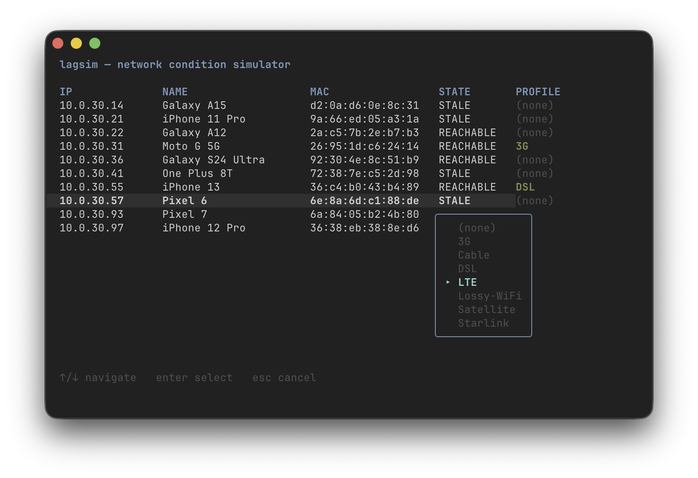

# lagsim

Network condition simulator for Linux routers. Injects latency, jitter, packet loss, reordering, and duplication per client IP using `tc`/`netem`/`ifb`.

Comes with built-in profiles for common network conditions (3G, LTE, Satellite, Starlink, etc.) and an interactive TUI to manage them.



## How it works

lagsim sets up an HTB qdisc tree on your LAN interface with per-client classes and netem leaf qdiscs. Ingress traffic is redirected through an IFB device so both upload and download are conditioned symmetrically.

```
LAN clients <──eth0.30──> router <──wan0──> internet
                 │
         HTB + netem (egress/download)
         IFB + netem (ingress/upload)
```

## Install

```bash
go build -o lagsim .
sudo cp lagsim /usr/local/bin/
```

## Usage

### Interactive TUI

```bash
sudo lagsim
```

Navigate clients with arrow keys, press Enter to select a profile, `e` to edit a device name, `r` to remove a profile.

### CLI

```bash
# List clients and their profiles
sudo lagsim list

# Show available profiles
sudo lagsim profiles

# Apply a profile to a client
sudo lagsim apply 192.168.1.100 3G

# Remove conditioning from a client
sudo lagsim remove 192.168.1.100

# Initialize tc infrastructure (auto-runs on first apply)
sudo lagsim init

# Tear down all tc rules
sudo lagsim teardown

# Dump raw tc state for debugging
sudo lagsim status
```

### Flags

| Flag | Description |
|------|-------------|
| `-c`, `--config` | Config file path (default `lagsim.yaml`) |
| `--dry-run` | Print tc commands without executing |
| `-v`, `--verbose` | Verbose output |

## Built-in profiles

| Profile | Delay | Jitter | Loss | Rate |
|---------|-------|--------|------|------|
| 3G | 200ms | 50ms | 1.5% | 2 Mbit |
| LTE | 50ms | 10ms | 0.5% | 50 Mbit |
| Lossy-WiFi | 15ms | 5ms | 3% | 20 Mbit |
| Starlink | 40ms | 7ms | 1% | 100 Mbit |
| Satellite | 600ms | 50ms | 1.5% | 5 Mbit |
| DSL | 25ms | 5ms | 0.2% | 25 Mbit |
| Cable | 10ms | 2ms | 0.05% | 200 Mbit |

## Configuration

Profiles, assignments, and device names are stored in `lagsim.yaml`:

```yaml
interfaces:
  lan: eth0       # LAN-facing interface
  ifb: ifb0       # IFB device (created automatically)
  subnet: 192.168.1.0/24
root_rate: 1gbit

profiles:
  3G:
    delay: 200ms
    jitter: 50ms
    correlation: 25%
    loss: 1.5%
    rate: 2mbit
  # add your own...

assignments:
  192.168.1.100: 3G
  192.168.1.101: LTE

names:
  aa:bb:cc:dd:ee:f0: Living Room TV
  aa:bb:cc:dd:ee:f1: Dad's Phone
```

Custom names are keyed by MAC address so they follow the device across IP changes.

Assignments persist across reboots -- run `lagsim init` at startup to restore them (e.g. via systemd or cron `@reboot`).

## Requirements

- Linux with `tc`, `ip`, and the `ifb` kernel module
- Root privileges
- Go 1.24+ to build

## License

MIT
